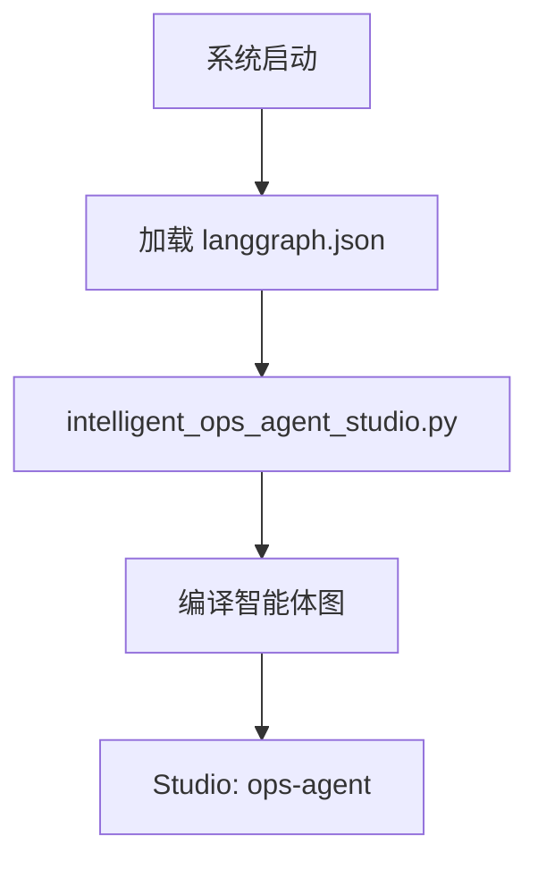

# 智能运维系统架构说明

## 智能体图架构

### 单层架构设计

我们现在采用单层架构，只包含智能体图：

```
langgraph.json 
    ↓ 包含一个图
└── ops-agent: 高层智能体图
    └── intelligent_ops_agent_studio.py:graph
```

### 关键文件说明

#### 1. `langgraph.json`
- **作用**: LangGraph Studio 的主配置文件
- **关键配置**: 
  - `"ops-agent"`: 高层智能体图
- **说明**: 每个图都直接指向编译好的图对象

#### 2. 智能体层 (`src/agents/`)
- **`intelligent_ops_agent.py`**: 智能体图实现
- **`intelligent_ops_agent_studio.py`**: 智能体 Studio 集成
- **职责**:
  - 任务导向的智能体行为
  - 初始化→路由→执行→完成
  - 支持多种任务类型 (process_alert, diagnose_issue, etc.)

### 架构优势

1. **分层设计**: 智能体处理任务导向
2. **独立编译**: 每个图单独编译，避免耦合
3. **灵活组合**: 可以单独使用智能体
4. **Studio 支持**: 智能体图都可以在 Studio 中可视化和调试

### 图的区别

#### 智能体图 (ops-agent)
- **用途**: 任务导向的智能体行为
- **状态**: `AgentState` - 包含智能体任务状态
- **节点**: 10个通用节点 (initialize, route_task, etc.)
- **适用**: 特定任务的智能处理

### 编译流程



### 使用方式

#### LangGraph Studio
```
访问: https://smith.langchain.com/studio/?baseUrl=http://127.0.0.1:2024
图选择: 
  - ops-agent: 智能体任务处理
```

#### Python 代码
```python
# 使用智能体图
from src.agents.intelligent_ops_agent import IntelligentOpsAgent
agent = IntelligentOpsAgent(config)
result = await agent.process_alert(alert_data)

# 或直接使用编译好的智能体图
from src.agents.intelligent_ops_agent_studio import graph as agent_graph
result = await agent_graph.ainvoke(agent_state)
```

### 状态结构

#### AgentState (智能体状态)
```python
{
    "agent_id": str,
    "current_task": str,
    "task_input": Dict,
    "task_output": Dict,
    "status": str,
    "stage": str,
    "analysis_result": Dict,
    "diagnostic_result": Dict,
    # ... 更多智能体相关状态
}
```

### 配置更新

根据需要修改不同层级：

1. **智能体层修改**:
   - 修改 `intelligent_ops_agent.py`
   - 重启 LangGraph 服务器
   - 影响 ops-agent 图

这种架构提供了更好的模块化和可扩展性，让不同层级的逻辑分离，便于维护和扩展。